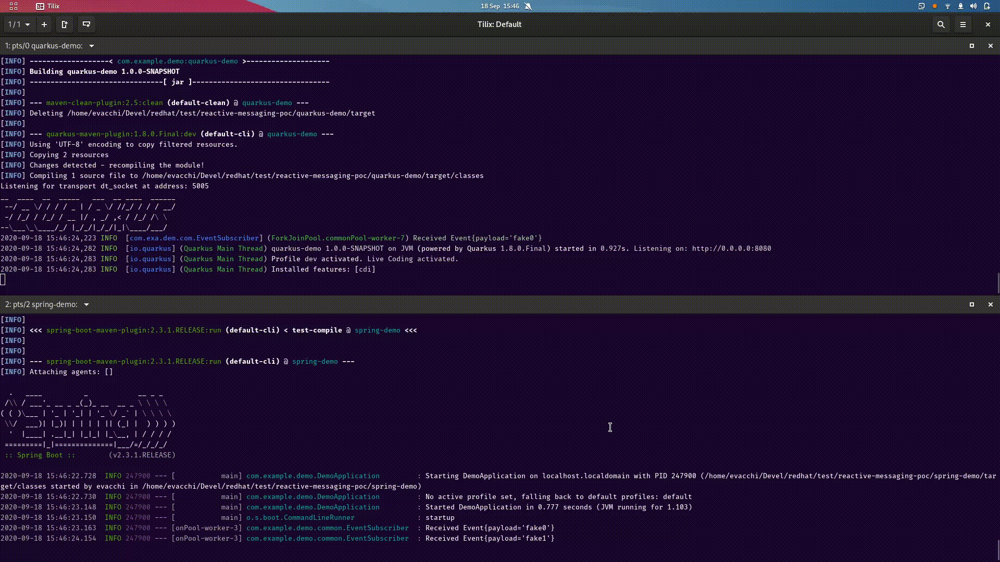
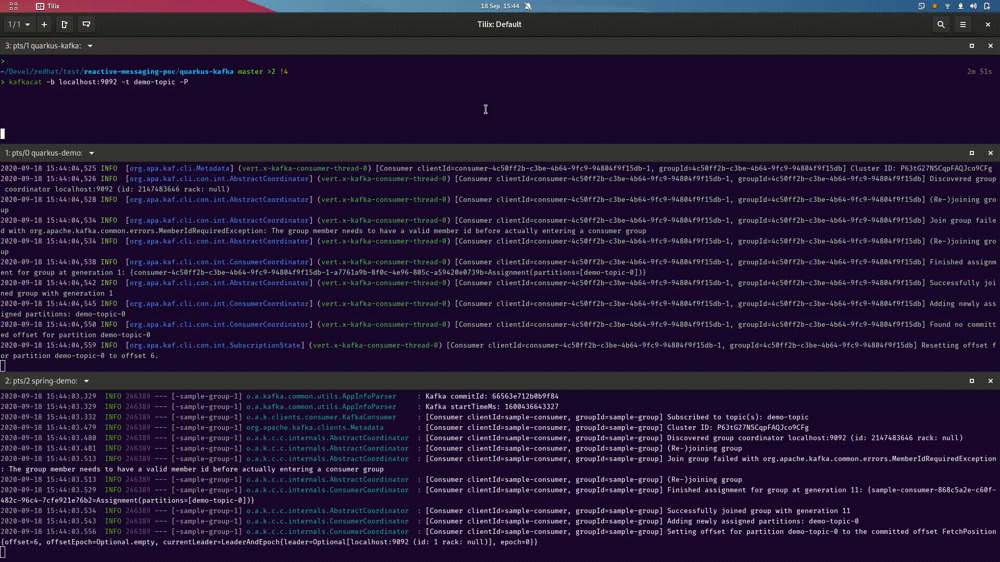

This demo project shows how to share a common implementation based on Reactive 
Streams for producing events. The implementation of a single event publisher
works seamlessly with both Spring and Quarkus.

## Usage 

First, recommended to install the parent project

    mvn install
    
Then, run the individual projects.

The project consists of the folowing components

|      project          |                       |
|-----------------------|-----------------------|
| common                | Shared data objects (`Event`) and utilites (`Subscribers`)
| common-data-generator | Shared `Publisher<T>` for fake generated data
| spring-kafka          | Kafka glue code for Spring 
| spring-demo           | Spring demo
| quarkus-kafka         | Kafka glue code for Quarkus
| quarkus-demo          | Quarkus demo


Each demo comes with two profiles:

`-Pgenerated` uses generated fake data
`-Pkafka` expects a running Kafka broker


## Generated Data



The [common-data-generator](common-data-generator) project
contains [one single class](common-data-generator/src/main/java/com/example/demo/common/data/Generator.java) 
annotated both with Spring and CDI annotations (scope: `provided`), with an 
implementation of a `Publisher<Event>`. 
`Event` (`common` project) is a data class contained in [common](common), that may represent
a Cloud Event envelope.

The fake data generator emits 1 event every second. You can customize it as you want.
It internally uses SmallRye Mutiny, but you may plug a reactive streams implementation of your choice.

### Running Quarkus

    cd quarkus-demo
    mvn quarkus:dev
    # or mvn quarkus:dev -Pgenerated 
             
You will see the following output:

```
__  ____  __  _____   ___  __ ____  ______ 
 --/ __ \/ / / / _ | / _ \/ //_/ / / / __/ 
 -/ /_/ / /_/ / __ |/ , _/ ,< / /_/ /\ \   
--\___\_\____/_/ |_/_/|_/_/|_|\____/___/   
2020-09-18 14:59:19,919 INFO  [com.exa.dem.com.EventSubscriber] (executor-thread-1) Received Event{payload='fake0'}
2020-09-18 14:59:19,973 INFO  [io.quarkus] (Quarkus Main Thread) quarkus-demo 1.0.0-SNAPSHOT on JVM (powered by Quarkus 1.8.0.Final) started in 0.967s. Listening on: http://0.0.0.0:8080
2020-09-18 14:59:19,974 INFO  [io.quarkus] (Quarkus Main Thread) Profile dev activated. Live Coding activated.
2020-09-18 14:59:19,975 INFO  [io.quarkus] (Quarkus Main Thread) Installed features: [cdi, mutiny, smallrye-context-propagation]
2020-09-18 14:59:20,917 INFO  [com.exa.dem.com.EventSubscriber] (executor-thread-1) Received Event{payload='fake1'}
2020-09-18 14:59:21,917 INFO  [com.exa.dem.com.EventSubscriber] (executor-thread-1) Received Event{payload='fake2'}
2020-09-18 14:59:22,917 INFO  [com.exa.dem.com.EventSubscriber] (executor-thread-1) Received Event{payload='fake3'}
2020-09-18 14:59:23,918 INFO  [com.exa.dem.com.EventSubscriber] (executor-thread-1) Received Event{payload='fake4'}
2020-09-18 14:59:24,917 INFO  [com.exa.dem.com.EventSubscriber] (executor-thread-1) Received Event{payload='fake5'}
...
```

the lines with `EventSubscriber` represent generated fake events. Ctrl-C to quit

### Running Spring

    cd spring-demo
    mvn spring-boot:run
    # or mvn spring-boot:run -Pgenerated 
    
You will see the following output:

```
  .   ____          _            __ _ _
 /\\ / ___'_ __ _ _(_)_ __  __ _ \ \ \ \
( ( )\___ | '_ | '_| | '_ \/ _` | \ \ \ \
 \\/  ___)| |_)| | | | | || (_| |  ) ) ) )
  '  |____| .__|_| |_|_| |_\__, | / / / /
 =========|_|==============|___/=/_/_/_/
 :: Spring Boot ::        (v2.3.1.RELEASE)

2020-09-18 14:59:00.278  INFO 232647 --- [           main] com.example.demo.DemoApplication         : Starting DemoApplication on localhost.localdomain with PID 232647 (/home/evacchi/Devel/redhat/test/reactive-messaging-poc/spring-demo/target/classes started by evacchi in /home/evacchi/Devel/redhat/test/reactive-messaging-poc/spring-demo)
2020-09-18 14:59:00.279  INFO 232647 --- [           main] com.example.demo.DemoApplication         : No active profile set, falling back to default profiles: default
2020-09-18 14:59:00.597  INFO 232647 --- [           main] com.example.demo.DemoApplication         : Started DemoApplication in 0.562 seconds (JVM running for 0.794)
2020-09-18 14:59:00.599  INFO 232647 --- [           main] o.s.boot.CommandLineRunner               : startup
2020-09-18 14:59:00.606  INFO 232647 --- [onPool-worker-3] com.example.demo.common.EventSubscriber  : Received Event{payload='fake0'}
2020-09-18 14:59:01.602  INFO 232647 --- [onPool-worker-3] com.example.demo.common.EventSubscriber  : Received Event{payload='fake1'}
2020-09-18 14:59:02.602  INFO 232647 --- [onPool-worker-3] com.example.demo.common.EventSubscriber  : Received Event{payload='fake2'}
2020-09-18 14:59:03.602  INFO 232647 --- [onPool-worker-3] com.example.demo.common.EventSubscriber  : Received Event{payload='fake3'}
2020-09-18 14:59:04.602  INFO 232647 --- [onPool-worker-3] com.example.demo.common.EventSubscriber  : Received Event{payload='fake4'}
2020-09-18 14:59:05.601  INFO 232647 --- [onPool-worker-3] com.example.demo.common.EventSubscriber  : Received Event{payload='fake5'}
...
```

the lines with `EventSubscriber` represent generated fake events. Ctrl-C to quit


## Live Kafka Events



This demo uses the native Quarkus and Spring facilities to plug a kafka 
connector that funnels data into the same Publisher of the generated version

### Setup

Start a local Kafka+Zookeeper in the root project

    docker-compose up 
    # or docker-compose -d up (if you want it run in background)
    
The broker is on `localhost:9092`. The demos will write on topic **demo-topic**.

You may start a kafka client to listen to the topic. We recommend `kafkacat`:

    kafkacat -b localhost:9092 -t demo-topic -C

We recommend starting a kafka producer too (on a separate terminal):
    
    kafkacat -b localhost:9092 -t demo-topic -P

In this console you may type one message per line. 

If everything is working, by typing a line in the producer, 
the consumer should echo it.

Use `Ctrl-C[Enter]` to quit.

### Quarkus

    cd quarkus-demo
    mvn quarkus:dev -Pkafka 
             
 When the application starts, type in the console with the producer, and send.
 The Application will echo your message.
 
The demo uses SmallRye Reactive Messaging + Kafka Connector. 
The only thing the kafka addon module does, is [pass on the data](quarkus-kafka/src/main/java/org/acme/EventConsumerFactory.java)
 
 
 ### Spring
 
    cd quarkus-demo
    mvn spring-boot:run -Pkafka 
             
 When the application starts, type in the console with the producer, and send.
 The Application will echo your message.

The demo uses [Reactor Kafka](https://projectreactor.io/docs/kafka/release/reference/#_reactive_api_for_kafka).
[A minimal amount of glue code is required](quarkus-kafka/src/main/java/org/acme/EventConsumerFactory.java), which
may not be necessary when or if
[this Reactor-based Kafka listener lands in the Reactor mainline](https://github.com/reactor/reactor-kafka/issues/100#issuecomment-502756802).
 
 If you run both demos (Spring+Quarkus) at once you will see them echo the same 
 message together.
 
 
 