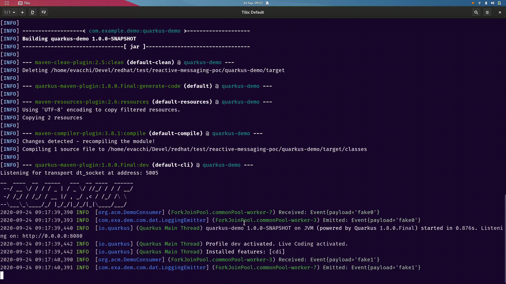
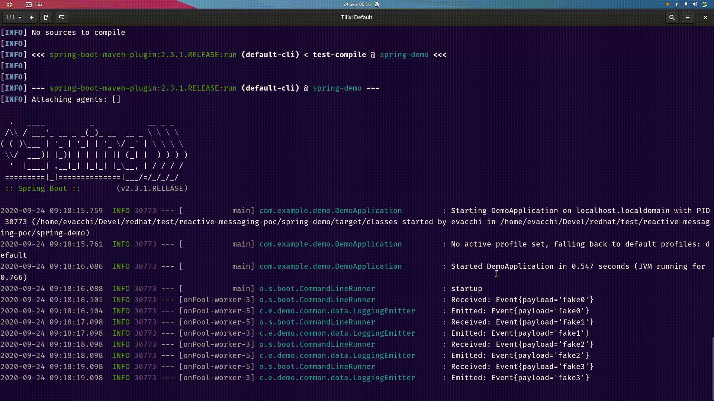

This demo project shows how to share a common implementation based on Reactive 
Streams for producing events. The implementation of a single `Publisher<CloudEvent>`
works seamlessly with both Spring and Quarkus.

For the emitting part, a `CloudEventEmitter` class was instead defined,
as the `Subscriber<CloudEvent>` API may be too cumbersome.

## Usage 

First, recommended to install the parent project

    mvn install
    
Then, run the individual projects.

The project consists of the folowing components

|      project           |                       |
|------------------------|-----------------------|
| common                 | Shared data objects (`Event`), `CloudEventEmitter` interface and utilities (`Subscribers`)
| common-data-generator  | Shared `Publisher<T>` for fake generated data
| common-logging-emitter | Shared `CloudEventEmitter` for fake generated data
| spring-kafka           | Kafka glue code for Spring 
| spring-demo            | Spring demo
| quarkus-kafka          | Kafka glue code for Quarkus
| quarkus-demo           | Quarkus demo

Each demo comes with two profiles:

`-Pgenerated` uses generated fake data
`-Pkafka` expects a running Kafka broker

## Generated Data

The [common-data-generator](common-data-generator) project
contains [one single class](common-data-generator/src/main/java/com/example/demo/common/data/Generator.java) 
annotated both with Spring and CDI annotations (scope: `provided`), with an 
implementation of a `Publisher<Event>`. 
`Event` (`common` project) is a data class contained in [common](common), that may represent
a Cloud Event envelope.

The fake data generator emits 1 event every second. You can customize it as you want.
It internally uses SmallRye Mutiny, but you may plug a reactive streams implementation of your choice.

### Running Quarkus

    cd quarkus-demo
    mvn quarkus:dev
    # or mvn quarkus:dev -Pgenerated 
             
Output lines with `EventSubscriber` and `LoggingEmitter` represent generated fake events. 
Ctrl-C to quit

### Running Spring

    cd spring-demo
    mvn spring-boot:run
    # or mvn spring-boot:run -Pgenerated 
    
Output lines with `EventSubscriber` and `LoggingEmitter` represent generated fake events. 
Ctrl-C to quit

## Live Kafka Events

This demo uses the native Quarkus and Spring facilities to plug a kafka 
connector that funnels data into the same Publisher of the generated version

### Setup

Start a local Kafka+Zookeeper in the root project

    docker-compose up 
    # or docker-compose -d up (if you want it run in background)
    
The broker is on `localhost:9092`. The demos will listen to topic **demo-topic**
and write to topic **output-topic**.

You may start a kafka client to listen to the topic. We recommend `kafkacat`:

    kafkacat -b localhost:9092 -t output-topic -C

We recommend starting a kafka producer too (on a separate terminal):
    
    kafkacat -b localhost:9092 -t demo-topic -P

In this console you may type one message per line. 

If everything is working, by typing a line in the producer, 
the consumer should echo it.

Use `Ctrl-C[Enter]` to quit.

### Quarkus

    cd quarkus-demo
    mvn quarkus:dev -Pkafka 
             
When the application starts, type in the console with the producer, and send.
Your message will be echoed to another topic
 
The demo uses SmallRye Reactive Messaging + Kafka Connector. 
The only thing the kafka addon module does, 
is pass on the data [from the input topic](quarkus-kafka/src/main/java/org/acme/EventConsumerFactory.java)
to [the output topic](quarkus-kafka/src/main/java/org/acme/QuarkusKafkaCloudEventEmitter.java)
 
 ### Spring

 
    cd quarkus-demo
    mvn spring-boot:run -Pkafka 
             
 When the application starts, type in the console with the producer, and send.
 The Application will echo your message.

The demo uses:
 
- Consumer: [Reactor Kafka](https://projectreactor.io/docs/kafka/release/reference/#_reactive_api_for_kafka) 
[A minimal amount of glue code is required](quarkus-kafka/src/main/java/org/acme/EventConsumerFactory.java), which
may not be necessary when or if
[this Reactor-based Kafka listener lands in the Reactor mainline](https://github.com/reactor/reactor-kafka/issues/100#issuecomment-502756802).
- Producer: [A plain Kafka Producer for writing (KafkaTemplate may be used if better)](spring-kafka/src/main/java/com/example/demo/SpringCloudEventKafkaEmitter.java)

 
 If you run both demos (Spring+Quarkus) at once you will see them echo the same 
 message together.
 
 
 